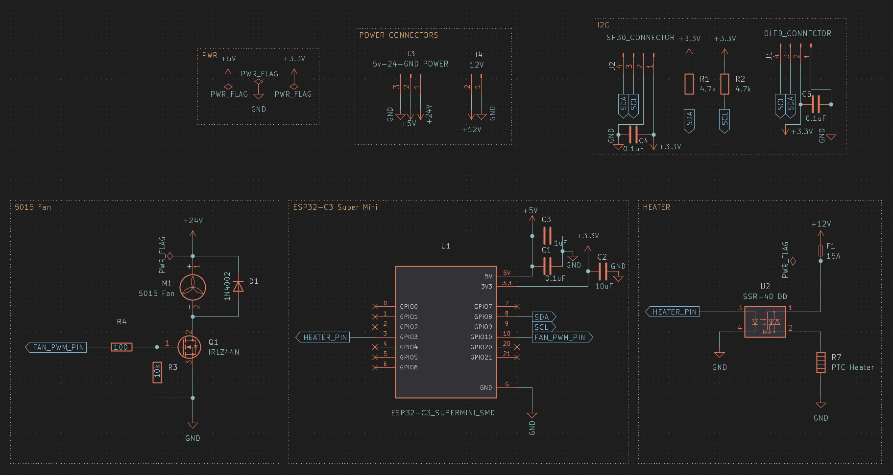
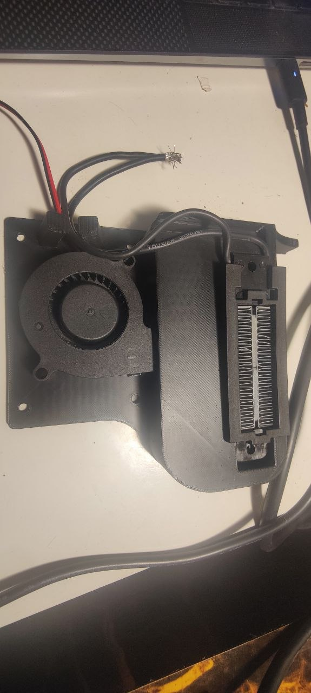
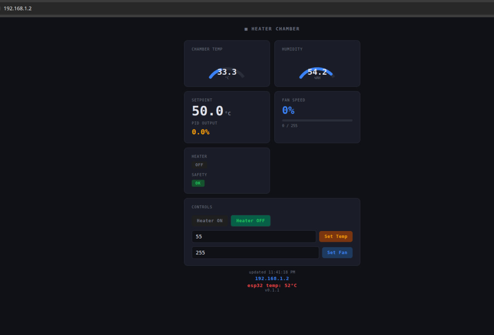

# ESP32 Active Heat Chamber

An ESP32-C3-based active heat chamber controller for 3D printers, designed to integrate with [Klipper](https://www.klipper3d.org/) via a REST API. It drives a PTC ceramic heater and a 5015 blower fan using closed-loop PID temperature control, and exposes an HTTP API that Klipper macros call directly via `gcode_shell_command`.

## Table of Contents

- [Features](#features)
- [Hardware](#hardware)
  - [Schematic](#schematic)
  - [Assembly](#assembly)
  - [Bill of Materials](#bill-of-materials)
  - [Pin Assignments](#pin-assignments)
- [Software Architecture](#software-architecture)
- [Dependencies](#dependencies)
- [Getting Started](#getting-started)
  - [Compile](#compile)
  - [Upload via USB](#upload-via-usb)
  - [OTA Updates](#ota-updates)
- [Configuration](#configuration)
- [REST API](#rest-api)
- [Klipper Integration](#klipper-integration) *(work in progress)*
- [License](#license)

---

## Features

- **PID temperature control** — closed-loop heater control with anti-windup
- **Time-proportional heater output** — SSR-compatible PWM-style on/off cycling (2 s cycle)
- **5015 blower fan control** — 25 kHz PWM via ESP32-C3 LEDC peripheral
- **SHT30 temperature + humidity sensor** — high-accuracy I²C sensor
- **OLED status display** — 128×64 SSD1306 showing temp, humidity, setpoint, fan, and PID power bar
- **HTTP REST API** — control heater, fan, and setpoint from any client
- **Klipper integration** *(work in progress)* — `klipper_chamber.cfg` with GCode macros
- **Automatic OTA firmware updates** — checks a self-hosted HTTPS server on boot and updates if a newer version is available
- **WiFiManager captive portal** — no hardcoded credentials; connect to the `HeaterChamber-XXXX` AP on first boot to configure WiFi
- **MCU temperature monitoring** — uses the ESP32-C3 internal temperature sensor
- **Safety limits** — hard cut-off at 65 °C and automatic recovery when temperature overshoots setpoint by ≥ 5 °C

---

## Hardware

### Schematic



> Place the exported schematic PNG at `docs/images/schematic.png`.

The circuit consists of four blocks:

| Block | Description |
|---|---|
| **ESP32-C3 Super Mini** | Main MCU — runs the HTTP server, PID loop, and OTA |
| **Heater driver** | SSR-40 DD solid-state relay switches 12 V to the PTC heater through a 15 A fuse |
| **Fan driver** | IRLZ44N logic-level MOSFET with 100 Ω gate resistor and 10 kΩ pull-down drives the 24 V 5015 fan |
| **I²C peripherals** | SHT30 sensor and SSD1306 OLED share the I²C bus with 4.7 kΩ pull-ups |

### Assembly



> Place the assembly photo at `docs/images/assembly.jpg`.

The 3D-printed mount (STL/STEP files in `enclosures/fan-ptcheater-holder/`) integrates a **5015 radial blower fan** and a **PTC ceramic heater** side-by-side. Airflow is forced through the PTC element and into the printer enclosure.

---

### Bill of Materials

| # | Component | Value / Part | Qty | Notes |
|---|---|---|---|---|
| U1 | ESP32-C3 Super Mini | — | 1 | SMD or through-hole module |
| U2 | Solid-state relay | SSR-40 DD | 1 | 12 V load side, 3.3 V control |
| Q1 | N-channel MOSFET | IRLZ44N | 1 | Logic-level gate, TO-220 |
| M1 | Blower fan | 5015, 24 V | 1 | ~1.5 A rated |
| — | PTC ceramic heater | 12 V, ~100 W | 1 | R7 in schematic |
| F1 | Fuse | 15 A | 1 | Inline on 12 V rail |
| D1 | Flyback diode | 1N4002 | 1 | Across fan motor |
| R1, R2 | I²C pull-up | 4.7 kΩ | 2 | SDA/SCL lines |
| R3 | Gate pull-down | 10 kΩ | 1 | MOSFET gate |
| R4 | Gate resistor | 100 Ω | 1 | MOSFET gate series |
| C1 | Bulk cap | 1 µF | 1 | 5 V rail |
| C2 | Bypass cap | 10 µF | 1 | 3.3 V rail |
| C3 | Bypass cap | 0.1 µF | 1 | 5 V rail |
| C4 | Bypass cap | 0.1 µF | 1 | SHT30 VDD |
| C5 | Bypass cap | 0.1 µF | 1 | OLED VDD |
| J2 | SHT30 connector | 4-pin SH1.0 | 1 | VDD, GND, SDA, SCL |
| J1 | OLED connector | 4-pin | 1 | VCC, GND, SCL, SDA |
| J3 | Power connector | 3-pin (5 V, 24 V, GND) | 1 | — |
| J4 | Power connector | 2-pin (12 V, GND) | 1 | — |
| — | SHT30 sensor module | — | 1 | I²C address 0x44 |
| — | SSD1306 OLED | 128×64 | 1 | I²C address 0x3C |

### Pin Assignments

| GPIO | Function |
|---|---|
| GPIO 3 | Heater SSR control (on/off) |
| GPIO 10 | Fan PWM (25 kHz LEDC) |
| GPIO 8 | I²C SDA (SHT30 + OLED) |
| GPIO 9 | I²C SCL (SHT30 + OLED) |

---

## Software Architecture

```
active_heat_chamber_esp32.ino   Main sketch: WiFi, HTTP server, sensor loop, PID loop
config.h                        Compile-time constants (pins, PID gains, safety limits)
heater_controller.h             Time-proportional on/off heater class
pid_controller.h                Generic PID with anti-windup and output clamping
oled_display.h                  SSD1306 status display
automatic_ota.h                 HTTPS OTA update client
```

The main loop runs three independent timed tasks:

| Task | Interval | Action |
|---|---|---|
| Sensor read | 1 s | Read SHT30 temp + humidity, run safety checks |
| PID update | 500 ms | Compute PID output, apply to `heater_controller` and fan |
| OLED refresh | 1 s | Redraw display |

---

## Dependencies

Install these via the Arduino Library Manager or `arduino-cli lib install`:

| Library | Purpose |
|---|---|
| `WiFiManager` | Captive-portal WiFi provisioning |
| `Adafruit GFX Library` | OLED graphics primitives |
| `Adafruit SSD1306` | SSD1306 OLED driver |
| `SensirionI2cSht3x` | SHT30/SHT31 sensor driver |
| `ArduinoJson` | JSON parsing for OTA manifest |
| `ElegantOTA` *(optional)* | Web-based OTA (disabled by default — uncomment `#define WEB_OTA`) |

Board package: **esp32 by Espressif** — install via Board Manager (`https://raw.githubusercontent.com/espressif/arduino-esp32/gh-pages/package_esp32_index.json`).

---

## Getting Started

### Compile

```bash
./build.sh
```

This calls `arduino-cli` targeting the **ESP32-C3** with CDC-on-boot enabled and the `min_spiffs` partition scheme:

```bash
arduino-cli compile -v \
  --fqbn esp32:esp32:esp32c3:CDCOnBoot=cdc,PartitionScheme=min_spiffs \
  --build-property "compiler.optimization_flags=-Os" \
  .
```

### Upload via USB

Connect the ESP32-C3 Super Mini over USB, then:

```bash
./upload.sh
```

This runs:

```bash
arduino-cli upload \
  -p /dev/ttyACM0 \
  --fqbn esp32:esp32:esp32c3:CDCOnBoot=cdc,PartitionScheme=min_spiffs \
  .
```

> Adjust the port (`-p /dev/ttyACM0`) if your device appears on a different path (e.g. `/dev/ttyUSB0`).

### OTA Updates

Firmware updates are served over HTTPS from a local server. The ESP32 checks `UPDATE_JSON_URL` (defined in `active_heat_chamber_esp32.ino`) on every boot.

#### 1. Generate TLS certificates

```bash
cd ota_server
./create_keys.sh   # creates cert.pem and key.pem (self-signed, valid 365 days)
```

#### 2. Build and package firmware

```bash
./build.sh         # compile the sketch
./flash.sh         # copies the .bin to ota_server/firmware.bin and writes firmware.json
```

`flash.sh` reads `FW_VERSION` from `config.h` and generates:

```json
{
  "version": "0.1.1",
  "firmware": "https://192.168.1.13/firmware.bin"
}
```

#### 3. Start the HTTPS server

```bash
cd ota_server
sudo python3 https_run.py   # serves on port 443
```

> For plain HTTP testing on port 80: `./http_run.sh`

Update `UPDATE_JSON_URL` in `active_heat_chamber_esp32.ino` to point at your server's IP.

---

## Configuration

All compile-time settings live in `config.h`:

```cpp
#define FW_VERSION       "0.1.1"

// GPIO
#define HEATER_PIN       3      // SSR control
#define FAN_PWM_PIN      10     // LEDC PWM output

// Fan PWM
#define FAN_FREQ_HZ      25000  // 25 kHz
#define FAN_RESOLUTION   8      // 0–255

// Safety
#define MAX_TEMP_C       65.0f  // Hard cut-off temperature
#define DEFAULT_TARGET   50.0f  // Default setpoint on boot
#define HEATER_CYCLE_MS  2000   // Time-proportional cycle period (ms)

// PID gains
#define PID_KP           0.08f
#define PID_KI           0.015f
#define PID_KD           0.005f

// I²C
#define I2C_SDA          8
#define I2C_SCL          9
```

Tune `PID_KP`, `PID_KI`, `PID_KD` to match your heater and fan combination.

---

## REST API

The HTTP server listens on port **80**. All responses are JSON.

| Method | Endpoint | Parameters | Description |
|---|---|---|---|
| `GET` | `/status` | — | Returns full chamber status |
| `POST` | `/heater` | `state=on\|off` | Enable or disable the heater |
| `POST` | `/temp` | `target=<20–80>` | Set target temperature (°C) |
| `POST` | `/fan` | `speed=<0–255>` | Override fan speed |

### `/status` response

```json
{
  "temp": 47.32,
  "humid": 28.10,
  "setpoint": 50.0,
  "heater": true,
  "fan": 180,
  "pid_output": 0.612,
  "safety_tripped": false,
  "sensor_fault": false,
  "mcu_temp": 38.50,
  "fw_ver": "0.1.1",
  "ip": "192.168.1.20"
}
```

### Examples

```bash
# Turn heater on
curl -X POST "http://192.168.1.20/heater?state=on"

# Set target to 60 °C
curl -X POST "http://192.168.1.20/temp?target=60"

# Set fan to 50 % (128/255)
curl -X POST "http://192.168.1.20/fan?speed=128"

# Read status
curl "http://192.168.1.20/status"
```

### Web UI

The ESP32 also serves a built-in web dashboard at `http://<ESP32_IP>/`. It auto-refreshes every second and provides full control without any external tooling.



> Place the web UI screenshot at `docs/images/webui.png`.

The dashboard shows:
- **Chamber Temp** and **Humidity** gauges
- **Setpoint** and current **PID output**
- **Fan speed** bar and value
- **Heater** state (ON/OFF) and **Safety** status
- Controls to toggle the heater, set target temperature, and set fan speed
- Footer showing last-update time, IP address, MCU temperature, and firmware version

---

## Klipper Integration

> **Work in progress** — the Klipper integration (`klipper_chamber.cfg` and `chamber_control.sh`) is functional but still being refined. Use the [REST API](#rest-api) or the [Web UI](#web-ui) for direct control in the meantime.

### 1. Install the `gcode_shell_command` plugin

```bash
cd ~/klipper
wget -O klippy/extras/gcode_shell_command.py \
  https://raw.githubusercontent.com/th33xitus/kiauh/master/resources/gcode_shell_command.py
```

### 2. Install the control script

```bash
sudo cp chamber_control.sh /usr/local/bin/chamber_control.sh
sudo chmod +x /usr/local/bin/chamber_control.sh
```

Edit `ESP32_IP` at the top of `chamber_control.sh` to match your ESP32's IP address (assign a static DHCP lease in your router for reliability).

### 3. Include the config

Add to `printer.cfg`:

```ini
[include klipper_chamber.cfg]
```

### Available GCode macros

| Macro | Example | Description |
|---|---|---|
| `CHAMBER_ON` | `CHAMBER_ON TEMP=60` | Enable heater and set target temperature |
| `CHAMBER_OFF` | `CHAMBER_OFF` | Disable heater and fan |
| `CHAMBER_TEMP` | `CHAMBER_TEMP TARGET=65` | Change setpoint while running |
| `CHAMBER_FAN` | `CHAMBER_FAN SPEED=180` | Set fan speed (0–255) |
| `CHAMBER_STATUS` | `CHAMBER_STATUS` | Print current status to console |
| `CHAMBER_WAIT` | `CHAMBER_WAIT TEMP=58` | Block until chamber reaches temperature |

### Typical print-start sequence

```gcode
CHAMBER_ON TEMP=60          ; start heating
CHAMBER_WAIT TEMP=55        ; wait until warm enough
; ... home, load filament, start print ...
CHAMBER_OFF                 ; cool down after print
```

---

## License

[LICENSE](LICENSE)
